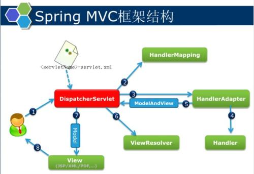
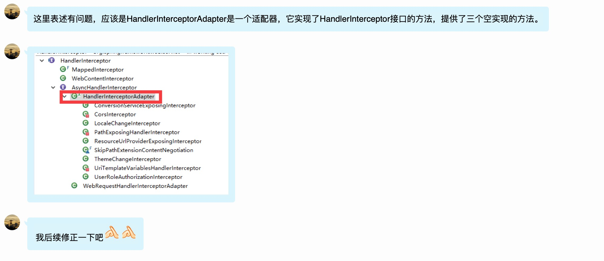

# Java EE互联网轻量级框架整合开发 SSM框架

***注：Spring MVC+Spring+MyBatis 和Redis的实现***

### 第三部分 Spring基础

#### 第11章  面向切面编程

#### 第12章 Spring和数据库编程

#### 第13章 数据库的相关知识

##### 13.4 数据库的相关知识

***注：我个人觉得这本书这里总结的非常好，我个人直接以拿来的注意方式摘录上面的话*** 

###### 13.4.1数据库事务的ACID特性

> 数据库正确执行的4个基础要素是原子性 *Atomicity* 、一致性 *Consistency* 、隔离性 *Isolation* 、持久性 *Durability* 
>
> * **Atomicity** : 整个事务中的所有操作，要么全部完成，要么全部不完成，不可能停滞在中间某个环节。事务在执行过程中发生错误，会被回滚到事务开始前的状态，就像这个事务从未被执行过。
> * **Consistency**: 指一个事务可以改变封装状态，事务必须始终保持系统处于一致的状态
> * **Isolation**:它是指两个事务之间的隔离程度
> * **Durability**:在事务完成以后，事务对数据库完成的修改所做的更改持久化保存在数据库中,并不会回滚。

这里的 **ACD** 都很好理解，就是Isolation不太好理解，于是书中举出了例子，叫***丢失更新***.

###### 13.4.2 丢失更新

直接例子:

假使夫妻双方同时操作一个**account** 

* 第一类丢失更新

| TimeStamp |      事务一（老公）      |                    事务二（老婆）                     |
| :-------: | :----------------------: | :---------------------------------------------------: |
|    T1     |     查询余额10000元      |                           -                           |
|    T2     |            -             |                    查询余额10000元                    |
|    T3     |            -             |                      网购1000元                       |
|    T4     |  **请客吃饭消费1000元**  |                           -                           |
|    T5     | 提交事务成功，余额9000元 |                           -                           |
|    T6     |            -             | **不想买了，取消购买，回滚事务到T2时刻，余额10000元** |

第一类更新场景出现于在多个事务并发的操作的过程中，一个回滚，一个提交成功，导致了数据的不一致，我们称之为第一个类丢失更新。目前，大部分数据库（包括 **Mysql和Oracle**）基本都已经消灭了这类丢失更新，所以书中未在赘述。

* 第二类丢失更新

还是直接给例子:

| TimeStamp |                     事务一（老公）                      |                      事务二（老婆）                       |
| :-------: | :-----------------------------------------------------: | :-------------------------------------------------------: |
|    T1     |                     查询余额10000元                     |                             —                             |
|    T2     |                            —                            |                      查询余额10000元                      |
|    T3     |                            —                            |                      **网购1000元**                       |
|    T4     |                  **请客户吃饭1000元**                   |                             —                             |
|    T5     | 提交事务成功，查询为10000元，消费1000元后，余额为9000元 |                             —                             |
|    T6     |                            —                            | 提交事务，根据之前余额10000元，扣减1000元后，余额为9000元 |

整个过程中存在两笔交易，一笔是老公请客吃饭，一笔是老婆的网购，但是两者都提交了事务，在不同的事物中，无法探知其他事物的操作，导致两者提交之后，余额都为9000元，而实际正确的应为8000元，这就是第二类丢失更新，而这里就体现了隔离级别的重要性。

###### 13.4.3 隔离级别

隔离级别有四个，分别为：脏读（**Dirty Read**）、读写提交（**Read Commit**）、可重复读(**Repeatable Read**)和序列化（**Serializable**）

* *for example **Dirty Read***:

| TimeStamp |       事务一（老公）       |     事务二（老婆）     |                       备注                       |
| :-------: | :------------------------: | :--------------------: | :----------------------------------------------: |
|    T1     |      查询余额10000元       |           —            |                                                  |
|    T2     |             ——             |    查询余额10000元     |                                                  |
|    T3     |                            | 网购1000元，余额9000元 |                                                  |
|    T4     | 请客吃饭1000元，余额8000元 |           ——           | 读取到事务二，未提交余额9000元，所以余额为8000元 |
|    T5     |          提交事务          |           ——           |                   余额为8000元                   |
|    T6     |                            |        回滚事务        |   由于第一类更新问题已经消除，所以余额为8000元   |

事务一可以读取事务二未提交的事务，这样的场景被称为**脏读**。

* *for example **Read Commit*** ：

读写提交可只读取已提交的事务，这样就不会出现事务回滚时的尴尬，示例如下：

| TimeStamp |       事务一（老公）       |     事务二（老婆）     |                             备注                             |
| :-------: | :------------------------: | :--------------------: | :----------------------------------------------------------: |
|    T1     |      查询余额10000元       |           ——           |                              ——                              |
|    T2     |             ——             |    查询余额10000元     |                              ——                              |
|    T3     |             ——             | 网购1000元，余额9000元 |                              ——                              |
|    T4     | 请客吃饭1000元，余额9000元 |           ——           | 由于事务二的余额未提交，采取 ***Read Commit***隔离级别的时候不能读出，所以余额为9000元 |
|    T5     |          提交事务          |                        |                         余额为9000元                         |
|    T6     |             ——             |        回滚事务        |                      余额为正确的9000元                      |

该隔离级别有个缺点，如果事务二在多次购物时，一直未提交，此时，事务一需要付款开启了事务，那么，事务一在消费的时候，查询当时的余额是够的，但事务二其实已经一直在消费了，只不过没有提交罢了，之后事务二先提交了消费，事务一提交的时候会导致余额不足，事务一失败。原因是账户余额对于事务一来说是只读了一次，那时那刻，余额是够的，没有重复的读取账户余额，账户余额是一个时刻会变化的值，这样的场景我们称为**不可重复读**（**unrepeatable read**）,***Read Commit***隔离级别出现的问题。

而此时，***Reapeatable Read***的使用场景。但是，可重复读这个概念是针对数据库同一条记录而言的，换句话说，可重读会使得**同一条**数据记录的读写按照一个序列化的进行操作，如果是多条数据而言，就会出现一个问题。**幻读（phantom read）**。

| 时刻 | 事务一(老公) |         事务二(老婆)         |                          备注                          |
| :--: | :----------: | :--------------------------: | :----------------------------------------------------: |
|  T1  |              | 查询消费记录为10条，准备打印 |                        初始状态                        |
|  T2  | 启用消费一笔 |                              |                                                        |
|  T3  |   提交事务   |                              |                                                        |
|  T4  |              |      打印消费记录为11条      | 老婆会认为多出一条的记录是不存在的，这样的场景成为幻读 |

为了克服幻读，SQL标准又提出了序列化的隔离标准。这里总结一下各类隔离级别和产生的现象

|   Isolation Lv    | Dirty Read | Unrepeatable Read | Phantom Read |
| :---------------: | :--------: | :---------------: | :----------: |
|   *Dirty Read*    |     ✔️      |         ✔️         |      ✔️       |
|   *Read Commit*   |     ❌      |         ✔️         |      ✔️       |
| *Repeatable Read* |     ❌      |         ❌         |      ✔️       |
|   *Seralizable*   |     ❌      |         ❌         |      ❌       |
|      Popular      |     ✔️      |         ❌         |      ❌       |

##### 13.5如何选择适合的隔离级别

和预想的一样，越是较高的隔离级别，对系统性能的损耗就越大。

> 从脏读到序列化，系统性能直线下降。序列化会严重压制并发，从而引发大量的线程挂起，直到获得锁才能进一步进行操作。

所以如何选择隔离级别呢？一般场景下都会使用***Read Commit***的隔离级别

###### 13.5.1 选择隔离级别

>在购物类的应用中，通过隔离级别控制数据一致性的方式比排除了，而对于脏读风险又过大。在大部分的场景下，企业会选择读/写提交的方式设置事务。这样有助于提高并发，又压制了脏读，但是对于数据一致性的问题并没有解决。

一般而言，都可以使用 **@Transactional**注解进行配置，下面是一段代码。

```java
@Autowired
private RoleDao roleDao=null;

//设置方法为读写的隔离级别
@Transactional(propagation=Propagation.REQUIRED,
              isolation=Isolation.READ_COMMITED)
public int insertRole(Role role){
    return roleDao.insert(role);
}
```

在在并发量不是很高的情况下，使用 ***Seralizable***的隔离级别也是一个不错的选择。

在实际开发过程中，注解**@Transactional**隔离级别的默认值为 **Isolation.DEAFALT**，其含义是默认的，随着数据库的变化而变化。对于不同数据库，隔离级别的支持是不一样的。**MYSQL**可以支持全部四种隔离级别，而默认级别是 **Repeatable Read**的隔离级别。而**Oracle**只能支持 **Read Commit**和 **Seralizatble**两种隔离级别，默认为 **Read Commit**。

###### 13.5.2 传播行为

本书作者最喜欢举的例子，关于信用卡还款，如果信用卡还款是批处理的方法，比如说，凑够了N张信用卡还款信息时，事务才会统一向数据库发生IO交互，那么如果其中一个信用卡还款失败了，那么其他所有还款的信用卡用户都会提示还款失败。RepaymentBatchService的batch方法来记录RepaymentService的repay方法，如果有一个repay方法失败了，那么如果只有一个事务，那么总事务将回滚。

当一个方法去调度另外一个方法的时候，可以对事物的特性进行传播配置，在开启总方法时，对repaymentService重新创建一个新的事物，如果此事务失败，不会回滚总事务。这种情况我们称之为传播行为。

Spring中一个枚举类来记录.

```java
org.springframework.transaction.annotation.Propagation
```

|   传播行为   |                             含义                             |                             备注                             |
| :----------: | :----------------------------------------------------------: | :----------------------------------------------------------: |
|   REQUIRED   | 当方法调用时，如果不存在当前事务，那么就创建一个新事物；如果之前的方法已经存在事务了，那么就沿用当前事务 |                     Spring **默认**配置                      |
|   SUPPORT    | 当方法调用时，如果不存在当前事务，那么就不启用事务；如果存在当前事务，那么就沿用当前事务 |                                                              |
|  MANDATORY   |              **意为强制**,方法必须在事务中执行               |                  如果不存在事务那么就抛异常                  |
| REQUIRED_NEW |              无论当前是否有事务，都会创建新事务              |                                                              |
| NOT_SUPPORT  | 不支持事务，如果不存在事务也不会创建事务；如果存在当前事务，则挂起它，直至该方法结束后才恢复当前事务 |                  适用于那些不需要事务的SQL                   |
|    NEVER     |  不支持事务,只有在没有事务的环境中才能运行，和Mandatory相反  |                    如果存在事务那就抛异常                    |
|    NESTED    | 嵌套事务，也就是说调用方法如果抛出异常只回滚自己内部的执行的sql，而不回滚主方法的sql | 如果数据库有存档点那么就保存在存档点上。如果没有存档点那就等同于REQUIRD_NEW |

一般情况下，我们主要关注的是required的传播级别，其次是required_new和nested（*嵌套的*）

##### 13.6 在Spring+MyBatis 组合中使用事务

##### 13.7 @Transactional的自调的失效问题

@Transactional的底层实现是Spring AOP技术，而Spring AOP技术使用的是动态代理。这就意味着对于静态**（static）方法和非public方法**，注解@Transactional是失效的（因为AOP要接口，要 *getClassLorder()*）。

而如果两个方法在一个Service里，自身调取本类中的另外一个Service方法，那么就会出现调用失效的问题。原因仍然是因为AOP技术原理本质是动态代理，自身调取自身方法时，无法实现AOP功能。

##### 13.8 常见的错误

1. 在Controller用同一个Service insert两次角色，这会导致开启了两个并不关联的事务。
2. 过长时间占用事务

```java
@Override
@Transactional(propagation=Propagation.REQUIRED,
              isolation=Isolation.READ_COMMITED)
public int insertRole(Role role){
    int result=roleMapper.insertRole(role);
    //操作一些与数据库无关的操作
    doSomethingForFile();
    return result;
}
```

假使 **doSomethingForFile()**方法是一个与数据库事务无关的操作，比如处理图片的上传之类的操作。那么这段代码就非常糟糕了。

当insertRole方法结束后Spring才能释放数据库事务资源，也就是说，doSomethingForFile方法未结束时，事务并没有释放。

>在大型互联网项目中，一个数据库的链接可能也就是50条左右，然而同时并发的请求则可能是成百上千。对于这些请求，大部分的并发请求都在等待50条占有数据库的链接资源，假如平均一个doSomethingForFile的操作需要一秒，对于同时出现1000条并发请求的网站，就会出现卡顿的状态。因为大部分的请求都在等待数据库事务资源的分配，这是一个糟糕的结果。


### 第四部分 Spring MVC 框架

#### 第14章 Spring MVC 的初始化和流程

##### 14.1MVC设计概述

mvc的设计初衷是为了解耦。

这段话解决了我之前的疑问，为什么Hibernate不流行了呢？

>对于持久层而言，随着软件发展，迁移数据的可能性很小，所以在大部分情况下都用不到hibernate的HQL来满足数据库迁移的要求。与此同时，性能对于互联网更为重要，不可优化SQL、不够灵活成了Hibernate难以治愈的伤痛，这样mybatis就崛起了。无论是Hibernate还是mybatis都没处理好数据库事物的编程，同时随着NoSQL的强势崛起，是的Java web应用不仅能够在数据库获取数据，也可以从NoSQL中获取数据，这些已经不是持久层框架能够处理的了，而Spring MVC给出了方案。

Spring MVC最大的特点就是模块化，**结构松散**。

##### 14.2 组件与流程

又是这张图：



*阿拉伯数字给出了组件运行的顺序*

Spring MVC框架是围绕着DispatcherServlet而工作的。

#### 第15章 深入Spring MVC组件开发

##### 15.1 控制器接受各类请求参数

###### 15.1.4 传递JSON参数

这里在之前开发的过程中，偶有不成功的地方，这里使用书中的例子来加深传递 **List<Ojbect>** 的情况

首先前端代码，这里使用了jQuery，其实无论使用那种前端语言，最重要的就是要设置post请求以及 ***contentType*** 这个参数。

```javascript
$(document).ready(function(){
    var roleList={
        {roleName:'role_name_1',note:'note_1'},
        {roleName:'role_name_2',note:'note_2'},
        {roleName:'role_name_3',note:'note_3'}
    };
 $.post({
    url:"./params/addRoles.do",
                  data:JSON.stringfy(roleList),
    contentType:"application/json",
        success:function (result){
          
        }              
    })
})
```

然后使用注解 **@requestBody** 来接受 **json** List

```java
@PostMapping("addRoles")
@ResponsBody
public ModelAndView addRoles(@RequestBody List<Role>roleList){
    ModelAndView mv=new ModelAndView;
    int total = roleService.insertRoles(roleList);
    mv.addObject("total",total);
    return mv;
}
```

##### 15.2 重定向

###### 15.2.1 重定向 传递参数的方法

一个重定向相当于二次请求，所以之前请求中的数据会丢失，那么重定向能否传递数据呢？Spring MVC提供了一个方法—— **flash**属性，我们需要建立一个数据模型 **RedirectAttribute**，见名知意，下面是个例子：

```java
@RequestMapping("/addRole3")
public String addRole3(RedirectAtrribute ra,Role role){
    roleService.insertRole(role);
    ra.addFlashAtrribute("role",role);
    return "redirect:./showRoleJsoninfo2.do";
}
```

这样就能传递POJO对象个下个地址了，其原理是使用addFlashAtrribute方法后，**SpringMVC**会将数据保存在

***Session***中（***Session***会在一个会话期有效），重定向后就将其清除，这样就能够传递数据给下一个地址了。

##### 15.3 保存并获取属性参数

##### 15.4拦截器

> 拦截器是Spring MVC中强大的控件，它可以在进入处理之前做一些操作，或者在处理器完成后进行操作，甚至是在渲染视图进行操作。SpringMVC会在启动期间就通过@RequestMapping的注解解析URI和处理器的对应关系，在运行的时候通过请求找到对应的HandlerMapping，然后构建HandlerExcutionChain对象，它是一个执行的责任链对象。

###### 15.4.1拦截器的定义

* **preHandle**方法：在处理器之前执行的前置方法，这样 **SpringMVC**可以在进入处理器前处理一些方法了。主要它将返回一个boolean值，会影响到后面**SpringMVC**的流程。
* **postHandle**方法：在处理器之后执行的后置方法，处理器的逻辑完成后会运行它。
* **afterCompletion**方法：无论是否产生异常都会在渲染视图后执行的方法。

###### 15.4.2 拦截器的执行流程

这里需要注意的是：**postHandle**是在视图解析和渲染视图之前，**Handle**之后

###### 15.4.3 开发拦截器

两种方式：

一种是xml：

```xml
<mvc:annotation-driven>
```

一种是Java配置的注解方式:

```java
@EnableWebMvc
```

当前加上注解时，系统会初始化拦截器**ConversionServiceExposingInterceptor**,它是个一开始就被Spring MVC系统默认加载的拦截器，它的主要作用是根据配置在控制器上的注解来完成对应的功能。

~~SpringMVC提供的公共拦截器 **HandlerInterceptorAdapter**，这两个注解，Spring之所以那么做，是为了提供适配器~~

以上是P420页的原文，表述有问题，联系作者本人：<u>**杨开振**</u>先生亲自解答了我，其原话如下:



```java
package com.atguigu.springboot.config;

import org.springframework.lang.Nullable;
import org.springframework.web.servlet.ModelAndView;
import org.springframework.web.servlet.handler.HandlerInterceptorAdapter;

import javax.servlet.http.HttpServletRequest;
import javax.servlet.http.HttpServletResponse;

/**
 * @Description:
 * @Author:Dn
 * @Date:Create in 11:19 AM 2019/1/15
 * @Modifid By:
 */
public class RoleInterceptor extends HandlerInterceptorAdapter {
    public boolean preHandle(HttpServletRequest request, HttpServletResponse response, Object handler) throws Exception {
        System.err.println("preHandle");
        return true;
    }

    public void postHandle(HttpServletRequest request, HttpServletResponse response, Object handler, @Nullable ModelAndView modelAndView) throws Exception {
        System.err.println("postHandle");
    }

    public void afterCompletion(HttpServletRequest request, HttpServletResponse response, Object handler, @Nullable Exception ex) throws Exception {
        System.err.println("afterCompletion");
    }
}

```

```xml
<mvc:interceptors>
    <mvc:interceptor>
        <bean class="**拦截器**全限定名"/>
    </mvc:interceptor>
</mvc:interceptors>
            
```

###### 15.4.4 多个拦截器执行的顺序

##### 15.5 验证表单

###### 15.5.1 使用JSR 303 注解验证输入内容

书中提供了所有注解的表格，其中有几个注解没用过，不太熟，列出来：

|             注解             |                         详细信息                         |
| :--------------------------: | :------------------------------------------------------: |
|     @DecimalMin（value）     | 被注释的元素必须是一个数字，其值必须大于等于指定的最小值 |
|     @DecimalMax（value）     | 被注释的元素必须是一个数字，其值必须小于等于指定的最大值 |
| @Digits（Integer，fraction） |     被注释元素必须是一个数字，其值必须在可接受范围内     |
|            @Past             |             被注释的元素必须是一个过去的日期             |
|           @Future            |             被注释的元素必须是一个未来的日期             |

#### 第16章 Spring MVC高级应用

##### 16.1数据格式化

有两个比较好用的注解:

```java
@Controller
@RequestMapping("/convert")
public class ConvertController{
    @RequestMapping("/format")
    public ModelAndView format(@RequestParam("date")@DateTimeFormat(iso=ISO.DATE)Date date,@RequestParam("amount1")@NumberFormat(pattern="#,###.##")Double amount){
        ModelAndView mv=new ModelAndView("index");
        mv.addObject("date",date);
        mv.addObject("amount",amount);
        return mv;
    }
}
```

通过注解**@DateTimeFormat**和**@NumberFormat**，然后通过iso配置的格式，处理器就能够将参数通过对应的格式化器进行转换，然后传递给控制器。

### 第17章 Redis概述

##### 17.1 Redis 在Java Web中的应用

这里面有一句话很重要，说明了使用Redis的使用场景。

>Redis存储的时候，需要从3个方面来考虑
>
>* 业务数据常用么？命中率如何？如果命中率很低，就没有必要写入缓存。
>* 该业务数据是读操作多，还是写操作多，如果写操作多，频繁需要写入数据库，也没有必要使用缓存。
>* 业务数据大小如何？如果要存储几百兆字节的文件，会给缓存带来很大的压力，有没有必要。

### 第18章 Redis数据结构常用命令 

##### 18.1 Redis数据结构-字符串

redis的数据结构：

|         命令          |                      说明                      |                             备注                             |
| :-------------------: | :--------------------------------------------: | :----------------------------------------------------------: |
|     set key value     |                   设置键值对                   |                        ep:set name dn                        |
|        get key        |                  通过键获取值                  |                      ep：get name  >:dn                      |
|        del key        |              通过key，删除键值对               |              删除命令，返回删除数，**通用命令**              |
|      strlen key       |             求key 指向字符串的长度             |                 返回的是key对应的value的长度                 |
| getrang key start end |                    获取子串                    | 记字符串的长度len，把字符串看成一个数组，而Redis是以0开始计数的，所以start 和 end 的取值范围为0到len-1 |
|    apend key value    | 将新的字符串value，加入到原来key指向的字符串末 |                  返回key指向新字符串的长度                   |

xml中配置关于Spring关于Redis字符串的运行环境，截取一段易出错的。

```xml
<bean id="redisTemplate" class="org.springframwork.data.redis.core.RedisTemplate">
<property name="connectionFactory" ref="connectionFactory"/>
<property name="keySerializer" ref="stringRedisSerializer"/>
<property name="valueSerializer" ref="stringRedisSerializer"/>
</bean>
```

这里引用原文对其特殊的地方进行说明：

>由于Redis的功能比较弱，所以经常会在Java程序中读取它们，然后通过Java进行计算并设置它们的值。这里使用Spring提供的RedisTemplate测试一下它们，**值得注意的是，这里使用的是字符串序列化器，所以Redis保存的还是字符串，如果采用其他的序列化器，比如JDK序列化器，那么Redis保存的将不会是数字而是产生异常**

Redis支持简单的运算

|           命令           |             说明              |        备注        |
| :----------------------: | :---------------------------: | :----------------: |
|         incr key         |         在原字段上加1         | 只能对整数进行操作 |
|   incrby key increment   | 在原字段上加上整数(increment) |   只能对整数操作   |
|         decr key         |         在原字段上减1         |   只能对整数操作   |
|   decrby key decrement   | 在原字段上减去整数(decrement) |   只能对整数操作   |
| incrbyfloat keyincrement | 在原字段加上浮点数(increment) |  只可以操作浮点数  |

代码放下：

```java
public static void testCal(){
    ApplicationContext applicationContext=new ClassPathApplicationContext("applicationContext.xml");
    RedisTemplate redisTemplate=applicationContext.getBean(RedisTemplata.class);
    redisTemplate.opsForValue().set("i","9");
    redisTemplate.opsForValue().increment("i",1);//增加键"i"的值为1，相当于incrby i 1命令；
    redisTemplate.getConnectionFactory().getConnection().decrBy(redisTemplate.getKeySerializer().serialize("i"),6);//相当于decrybu i 6;
}
```

减法这么操作的原因是，Redis的版本在更替，支持的命令会有所不一，而Spring提供的RedisTemplate方法不足不足以支撑Redis的所有命令，所以这里才有这样的变化。七次，其次，所有关于减法的方法，原有值都必须是整数，否则就会引发异常。

##### 18.2 Redis 数据结构-哈希

就是个hashmap

##### 18.3 Redis 数据结构-链表

和LinkedList差不多，又有了堆栈的属性，和queue最像，两个方向可以进入，左边操作的就是l，右边操作的就要加r，需要特别注意的就是insert操作，需要更底层的命令。RedisTemplate没办法直接实现：

```java
redisTemplate.getConnectionFactory().getConnection().lInert("list",getBytes("uftf-8"),RedisListCommands.Position.BEFORE,"node2".getByte("uft-8"),"before_node".getBytes("utf-8"));
```

由于是链表，查询非常慢，随机插入删除比较快的。在多值操作的时候，往往会使用list进行封装，比如说leftPushAll命令，对于很大的list的操作需要注意性能，比如remove这样的操作，在大的链表中会消耗Redis系统很多的性能。

另外，Redis对链表有阻塞时操作（线程安全，操作数据时不释放锁。）

##### 18.4 Redis 数据结构-集合

##### 18.5 Redis 数据结构-有序集合

### 第19章 Redis的一些常用命令

##### 19.1 Redis的基础事务

使用***multi***来开启事务，之后通过***exec***执行事务。

##### 19.2 Reids事务的回滚

值得注意的是：

> 在命令执行入队的时候，如果是命令语法发生了问题，会提示报错，并该次事务中所有的操作都不会被执行.


但是，如果是仅仅只是数据格式有问题，事务中的其他操作都是会被执行的，目的是为了性能。


**value3**不是一个Integer，我使用了incr key3命令在事务中并不会报错，在最后提交事务的时候有报错，但是不影响我在本次事务中的其他操作。

##### 19.3 用watch命令监控事务

有watch命令参与的事务执行顺序如下：

1. watch一个key，此key在执行任务期间不能发生变化，如果发生变化，那么事务将回滚。
2. multi命令开启事务。
3. 事务操作，加入命令**QUEUE**
4. exec命令提交事务

> Redis参考了多线程中使用的CAS（比较与交换，**Compare And Swap**）去执行的，在数据高并发环境中，我们称之为**乐观锁**。

CAS原来会产生ABA问题，ABA问题:

| 时刻顺序 |       线程1       |    线程2     |              说明               |
| :------: | :---------------: | :----------: | :-----------------------------: |
|    T1    |        X=A        |              |         线程1加入监控X          |
|    T2    |   复杂运算开始    |   修改X=B    |       线程2修改X，此刻为B       |
|    T3    |      执行中       | 处理简单业务 |                                 |
|    T4    |      执行中       |   修改X=A    |            又变回了A            |
|    T5    |      执行中       |  结束线程2   |                                 |
|    T6    | 检查X=A，验证通过 |              | CAS原理通过，因为和旧值保持一致 |

对于线程2，X的值变化为A->B->A，所以CAS原理的这个设计缺陷被形象地称为**“ABA问题”**。

##### 19.4 流水线(pipelined)

